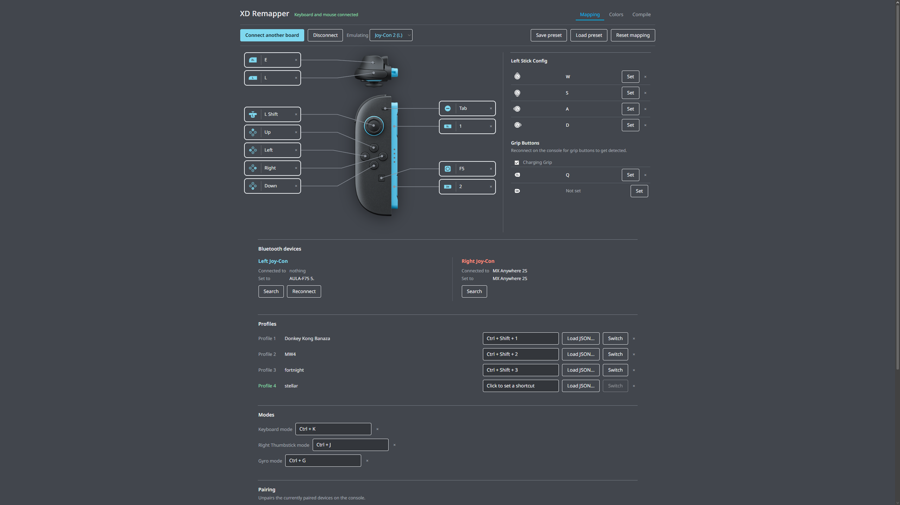
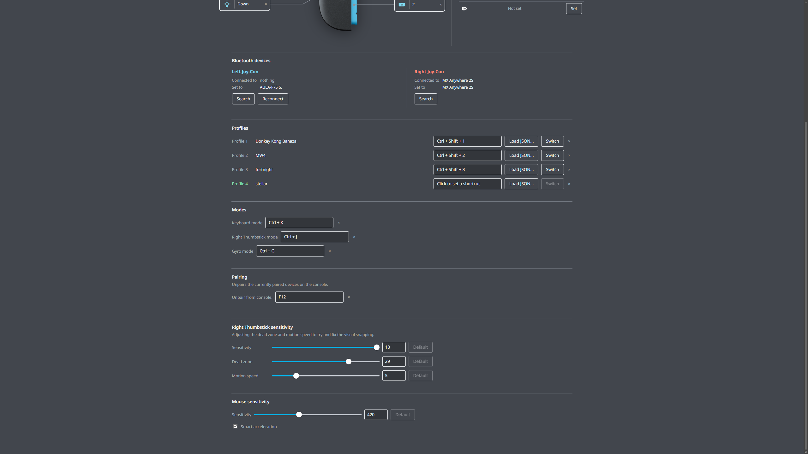
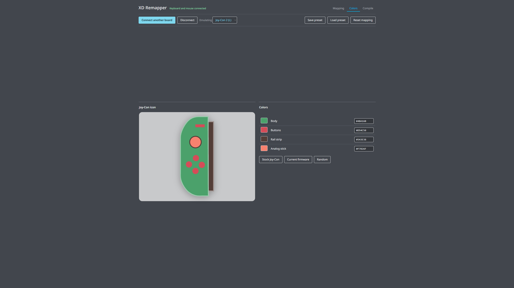
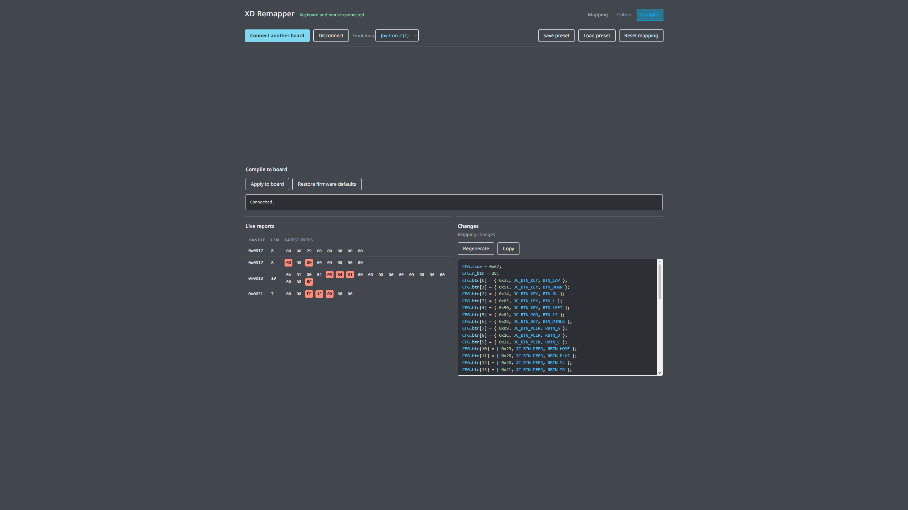

# XD2Joy-Webtool

Main icon buttons are from [Switch 2 Button Icons and Controls](https://zacksly.itch.io/switch-2-button-icons-and-controls) by Zacksly, used under CC BY 3.0, and are not made by me.

The font is Noto Sans by The Noto Project Authors, under the SIL Open Font License 1.1, the license is in [fonts/OFL.txt](fonts/OFL.txt).

For issues or remapping the source code is here, use a web browser with com port support.
